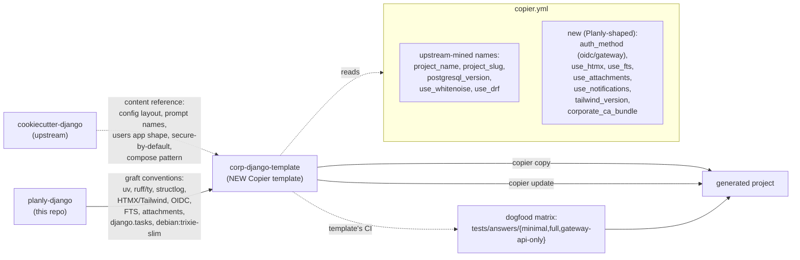

# Plan: Build Corporate Django Template — Copier engine, cookiecutter-django as content source

## Context

The Planly tutorial (commits up through `9afe277`) produced a working reference application — corporate deploy patterns, OIDC SSO appendix, FTS, HTMX, DRF — across 18 chapters and one appendix. We want a starter template that future internal Django projects use, so the architecture isn't re-derived each time.

**Two design decisions, both fixed by user direction:**

1. **Engine: Copier.** Picks up `copier update` so generated projects can pull template improvements after creation, and the cleaner Jinja syntax (`{{ project_slug }}` instead of `{{cookiecutter.project_slug}}`).
2. **Content source: cookiecutter-django.** It's the de-facto standard, ships a maintained `config/settings/{base,local,test,production}.py` split, an `apps/` package layout, custom-user-model wiring, secure-by-default settings, multi-stage Docker, and a CI matrix. We mine it for content rather than rebuilding from scratch.

Because the engines differ, this is a **port**, not a fork. We read cookiecutter-django's `{{cookiecutter.project_slug}}/` tree to know what should be in the template; we rewrite the templating layer in Copier (`copier.yml`, `_templates_suffix: .jinja`, `_tasks` hooks, `path` for conditional dirs/files). We don't `git merge` from upstream — we manually translate updates we want.

**Trade-off acknowledged:** we lose automatic upstream tracking. The mitigation is `UPSTREAM.md` documenting the cookiecutter-django commit we mined, the deviations we made, and a quarterly review cadence to pull selectively.

**Drivers:**
- "It worked for Planly, do it again" — copy-pasting by hand is expensive.
- The corporate environment standardizes on patterns Planly settled (Postgres-only, structlog-JSON, libmagic-validated uploads, GitLab CI, no Sentry, debian:trixie-slim + uv-managed Python). Our deviations from cookiecutter-django defaults need to be the **defaults**, not opt-ins.
- Cookiecutter-django offers prompts we'll want for the corporate template (custom user model, DRF toggle, GitLab CI, Postgres version, WhiteNoise toggle, security headers); having `copier update` makes it worth porting.

**Outcome:** a separate Copier template repo consumed via `copier copy <repo> my-new-app`, producing a project with the Planly architecture minus the Planner-specific domain. Toggles match Planly's optional features; cookiecutter-django toggles that don't apply (Heroku, GitHub Actions, Compressor/Gulp/Webpack, allauth, Celery, Sentry, Mailpit, multiple cloud providers) are dropped.

## What we keep from cookiecutter-django (content)

The shape and layout of these come from upstream; we just retype them in Copier syntax.

| Asset | Why we keep it |
|---|---|
| `config/settings/{base,local,test,production}.py` split | Matches Planly's exact layout |
| `users/` app structure (custom user model, `admin.py`, `factories.py`, `tests/`) | Pattern is right; we rename to `apps/accounts/` and swap fields for `employee_id`+Team+Membership |
| Multi-stage Dockerfile + compose layout (`compose/local/django/`, `compose/production/django/`, `compose.local.yml`, `compose.production.yml`) | Layout matches Planly; we change the **base image** (`python:3.14-slim` → `debian:trixie-slim` + uv-managed Python) and **package manager** (pip → uv), not the structure |
| Secure-by-default `production.py` (HSTS, SSL redirect, `SECURE_*` headers) | Same block Planly's `production.py:52-64` already has |
| `manage.py`, `wsgi.py`, `asgi.py` | Verbatim |
| GitLab CI integration | Upstream has it as a `ci_tool` choice; we make it the only option |
| Prompt machinery and project-name validation logic | Reimplemented in `copier.yml`'s validators; the *logic* (slug regex, package-name normalization) comes from upstream's `hooks/pre_gen_project.py` |
| `tests/test_cookiecutter_generation.py` matrix shape | Reimplemented as a Copier-driven dogfood matrix; the *shape* (generate sample projects, run their tests) is upstream's |

## What we drop from cookiecutter-django

These prompts and code paths don't apply in the corporate environment, so they don't make it into the port.

| Dropped | Reason |
|---|---|
| `cloud_provider` choices except None / S3-compatible | Internal S3-compatible storage only |
| `mail_service` (multi-provider Anymail) | Corporate mail is an SMTP relay |
| `frontend_pipeline` (Compressor/Gulp/Webpack) | Replaced by HTMX + standalone Tailwind binary |
| `use_celery` | Replaced by Django 6's built-in `django.tasks` |
| `use_sentry` | Corporate observability assumes log aggregation, not SaaS |
| `use_mailpit` | Console email backend in `local.py` is sufficient |
| `use_async` | Sync-only; no current need for ASGI |
| `editor` | Editor dotfiles are personal, not template territory |
| `use_heroku`, `Procfile` | Self-hosted infrastructure |
| `ci_tool` choices except GitLab CI | GitLab is the corporate standard |
| `username_type=username` | Mandates `employee_id` PK from the start |
| `use_allauth` (django-allauth) | Replaced by `mozilla-django-oidc` (OIDC) or corp-gateway middleware skeleton |
| Black, isort, flake8, mypy pre-commit hooks | Replaced with Ruff (lint+format) and ty (type-check) |
| `requirements/*.txt`, pip-tools | Replaced with `pyproject.toml` + uv |
| django-environ | Replaced with python-dotenv + `os.environ.get(...)` (matches Planly) |

## What we graft on from Planly

These are the patches the port carries on top of upstream content. Each maps to a concrete Planly file we transcribe.

| Planly source | Lands at | Notes |
|---|---|---|
| `pyproject.toml` | `pyproject.toml.jinja` | Replaces `requirements/{base,local,production}.txt`; deps conditional on toggles; `name`/`description` use `{{ project_name }}` / `{{ description }}` |
| `Dockerfile` | `compose/production/django/Dockerfile.jinja` and `compose/local/django/Dockerfile.jinja` | Replaces upstream's pip-based Dockerfile; debian:trixie-slim + uv; conditional `libmagic1` and `update-ca-certificates` blocks |
| `gunicorn.conf.py` | `gunicorn.conf.py` | Verbatim — upstream uses inline gunicorn args; we prefer Planly's standalone config file |
| `compose.{yaml,override.yaml,prod.yaml,services.yaml}` | `compose.local.yml.jinja`, `compose.production.yml.jinja`, `compose.services.yml` | Renamed to upstream's `local`/`production` convention; preserve `develop.watch` blocks; worker service conditional on `use_notifications`; tailwind watcher conditional on `use_htmx` |
| `config/settings/base.py` (Planly version) | `config/settings/base.py.jinja` | Replaces upstream's django-environ-based base.py with Planly's `os.environ.get(...)` pattern; preserve upstream's secure-by-default block in `production.py` |
| `config/settings/{local,test,production}.py` (Planly version) | same path with `.jinja` | Lift Planly's fail-fast block (`production.py:18-47`); structlog JSON renderer (`production.py:152-183`); `ImmediateBackend`/`DummyBackend`/`DatabaseBackend` rotation for `TASKS` |
| `config/urls.py`, `config/api_router.py` | same, `.jinja` where conditional | Match Planly's flat-router pattern; `api_router.py` only when `use_drf` |
| `apps/core/{models,views,urls,querysets,apps}.py` + `migrations/0001_extensions.py` | `apps/core/...` | `TimeStampedModel`, `OrderedModel`, `/health/` view always; `search/` view + extensions migration only if `use_fts` |
| `apps/accounts/{models,managers,admin,apps}.py` | `apps/accounts/...` | Replaces upstream's `users/`; `User` (employee_id PK), `Team`, `Membership`, `Discipline` |
| `apps/accounts/auth.py` (transcribed from Appendix A) | `apps/accounts/auth.py.jinja` | Conditional on `auth_method == oidc`. The file does **not** exist in the Planly tree — transcribed from `docs/tutorial/appendix-a-corporate-sso.md` lines 167–275 |
| `apps/accounts/api/authentication.py` (transcribed from Appendix A) | `apps/accounts/api/authentication.py.jinja` | Conditional on `use_drf and auth_method == oidc`. Transcribed from appendix lines 318–398 |
| `apps/accounts/gateway_auth.py` | `apps/accounts/gateway_auth.py.jinja` | New code, not in Planly. Conditional on `auth_method == gateway`. Skeleton trusting `X-Forwarded-User`; `TODO(team):` markers |
| `apps/attachments/` | `apps/attachments/` (under `` dir) | Lifted verbatim from Planly |
| `apps/notifications/` | `apps/notifications/` (under `` dir) | Lifted verbatim |
| `templates/{base.html,partials/,registration/}` + `static/{vendor,css}` | same paths (under `` for HTMX-only ones) | Replaces upstream's Bootstrap 5 templates |
| `apps/conftest.py` | same path | Verbatim |
| `.gitlab-ci.yml` | `.gitlab-ci.yml.jinja` | Replaces upstream's; conditionals: `schema` job iff `use_drf`, `libmagic1` iff `use_attachments`, OIDC stub env vars iff `auth_method == oidc` |
| `.env.example` | `.env.example.jinja` | Replaces upstream's; toggle-aware |
| `lefthook.yml` | `lefthook.yml` | NEW (Planly's CLAUDE.md mentions it but ships no file). Runs `ruff check`, `ruff format --check`, `ty check` pre-commit |
| `apps/example/` | `apps/example/` | NEW placeholder. One `Item` model; CRUD CBVs; tests. Day-one task: `git rm -r apps/example` and add real domain |

## copier.yml prompts (final shape)

Reuses cookiecutter-django prompt names where the question still applies; renames where the choice space changes; adds Planly-shaped toggles.

| Prompt | Source | Type | Default | Drives |
|---|---|---|---|---|
| `project_name` | upstream | str | (required) | Display name |
| `project_slug` | upstream | str | derived from `project_name`, validated | Pyproject `name`, root dir |
| `description`, `author_name`, `email`, `domain_name`, `version`, `timezone` | upstream | str | reasonable defaults | Pyproject + settings |
| `python_version` | new | choice | `"3.14"` | pyproject, Dockerfile, ruff, ty |
| `tailwind_version` | new | str | `"v4.1.10"` | Dockerfile `TAILWIND_VERSION` ARG |
| `postgresql_version` | upstream | choice | `"17"` | compose `db` service image |
| `auth_method` | new (replaces `username_type` + `use_allauth`) | choice (`oidc`, `gateway`) | `oidc` | Auth scaffolding |
| `use_drf` | upstream rename | bool | `true` | DRF + spectacular + auth class |
| `use_htmx` | new (replaces `frontend_pipeline`) | bool | `true` | base.html + Tailwind + partialdef |
| `use_fts` | new | bool | `false` | unaccent + pg_trgm + GeneratedField |
| `use_attachments` | new | bool | `false` | django-storages[s3] + libmagic |
| `use_notifications` | new (replaces `use_celery`) | bool | `false` | Notification model + django.tasks fan-out + worker service |
| `use_whitenoise` | upstream | bool | `true` | WhiteNoise middleware |
| `corporate_ca_bundle` | new | bool | `true` | `update-ca-certificates` block in Dockerfile |
| `gitlab_runner_image` | new | str | `"python:3.14-slim-trixie"` | CI image |
| `open_source_license` | upstream | choice | `"Proprietary"` | LICENSE file |

## Shape of the change



## Approach

**Scaffold → port → graft → dogfood.** Four phases.

### Phase A — Copier scaffold (0.5 day)

**A1. Create the template repo skeleton.**
- New empty repo `corp-django-template/`.
- `copier.yml` with prompts above + validators (`project_slug` regex, `package_slug` Python identifier check).
- `copier.yml` config keys: `_templates_suffix: .jinja`, `_subdirectory: template`, `_tasks: [...]`, `_envops: { keep_trailing_newline: true }`, `_message_after_copy:`, `_message_after_update:`.
- `template/` subdirectory will hold the templated tree (Copier renders `template/` into the destination).
- `tests/` for Copier-side tests (`copier.run_copy()` from Python; pytest harness adapted from cookiecutter-django's `tests/test_cookiecutter_generation.py`).
- `UPSTREAM.md` with the cookiecutter-django commit we mined and the deviation list.
- Template-side `README.md` and `.gitlab-ci.yml` for the dogfood matrix.

### Phase B — Port the always-on core (2 days)

Translate cookiecutter-django's tree into Copier templates, with Planly conventions substituted in. One commit per area so the diff is reviewable.

**B1. Tooling.**
- `pyproject.toml.jinja` — Planly's `pyproject.toml` with `name`/`description`/`requires-python` Jinja-substituted.
- `compose/{local,production}/django/Dockerfile.jinja` — Planly's `Dockerfile` split into the two-file layout cookiecutter-django uses, with conditional blocks for `use_attachments` (libmagic) and `corporate_ca_bundle`.
- `lefthook.yml` — new file (replaces upstream's `.pre-commit-config.yaml`).
- `.gitlab-ci.yml.jinja` — Planly's CI with the `before_script` apt list rendered conditionally.

**B2. Settings.**
- Translate Planly's `config/settings/{base,local,test,production}.py` into `.jinja` templates.
- Replace `django-environ` calls with `os.environ.get(...)` + `python-dotenv` (Planly pattern).
- Embed conditional blocks for: OIDC settings (`auth_method == oidc`), DRF block (`use_drf`), Tailwind/Crispy block (`use_htmx`), AWS_* block (`use_attachments`), `STORAGES` S3 swap (`use_attachments` in production), `<SLUG>_MAX_*` constants (always present, named after `package_slug`).
- Always-on: structlog configure, fail-fast checks, `LOGGING` dict (console renderer dev / JSON renderer prod), Postgres-backed `db.DatabaseCache`.

**B3. Apps.**
- `apps/core/` — `TimeStampedModel`, `OrderedModel`, `/health/` view, `apps/conftest.py` — verbatim from Planly. `search` view and `0001_extensions.py` under ``.
- `apps/accounts/` — `models.py`, `managers.py`, `admin.py`, `apps.py` from Planly. Note: the empty stubs (`signals.py`, `tasks.py`, `views.py`) in Planly are skipped — generated projects can add their own.
- `apps/example/` — new placeholder app. One `Item` model with `for_user()` queryset method (mirrors `apps/plans/querysets.py`); CRUD CBVs; tests covering model, queryset, views, API. Conditional sub-pieces: DRF viewset (`use_drf`), `search_vector` field (`use_fts`), attachment relation (`use_attachments`), notification fan-out (`use_notifications`), HTMX detail template (`use_htmx`).

**B4. Templates and static.**
- `templates/base.html.jinja` with full HTMX/Tailwind wiring under `use_htmx`, minimal HTML otherwise.
- `templates/pages/home.html`, `templates/partials/_form_card.html`, `templates/partials/_confirm_delete.html` from Planly — partials only emitted when `use_htmx`.
- `templates/registration/login.html` only when `auth_method != oidc` (OIDC path uses `mozilla_django_oidc.urls`).
- `static/vendor/htmx.min.js`, `static/css/source.css` under `use_htmx`. Configure these as binary-safe (Copier copies them without rendering — they have no `.jinja` suffix and aren't in the templates suffix list).

### Phase C — Auth toggle and per-feature conditionals (1.5 days)

**C1. Auth toggle (`auth_method`).**
- `oidc` path: `apps/accounts/auth.py.jinja` (`PlanlyOIDCBackend`, `provider_logout`) and (when `use_drf`) `apps/accounts/api/authentication.py.jinja` (`OIDCJWTAuthentication`). Both transcribed from `docs/tutorial/appendix-a-corporate-sso.md` lines 167–275 and 318–398. Add `mozilla-django-oidc` and `pyjwt[crypto]` to deps; OIDC settings to `base.py`; `path("oidc/", ...)` to `config/urls.py`; OIDC stub env vars to `.gitlab-ci.yml`.
- `gateway` path: `apps/accounts/gateway_auth.py.jinja` — new code, not in Planly. `RemoteUserMiddleware`/`RemoteUserBackend` skeleton trusting `X-Forwarded-User` (employee_id) and `X-Forwarded-Groups` (comma-separated). `TODO(team):` markers at every gateway-specific knob (signature scheme, header names, group claim mapping). When also `use_drf`: a `GatewayAPIAuthentication` DRF class reading the same headers.

**C2. Per-toggle conditional generation.** Each of these is a `` directory or block; Copier's docs confirm the `path.jinja` pattern for conditional file paths.
- `use_drf` — `apps/accounts/api/`, `apps/example/api/`, `config/api_router.py`, `REST_FRAMEWORK` block, `SPECTACULAR_SETTINGS`, JWT/JWKS deps, CI `schema` job.
- `use_htmx` — base.html branch, partials, vendored HTMX/Tailwind, deps, settings, Dockerfile tailwind build step, compose `tailwind` watcher service.
- `use_fts` — `0001_extensions.py`, `search` view + URL, example app `search_vector`, `django-pgtrigger` dep, `django.contrib.postgres` in `INSTALLED_APPS`.
- `use_attachments` — `apps/attachments/`, libmagic apt-install, `python-magic` + `django-storages[s3]` deps, AWS_* env vars, S3 backend in production. When also `use_htmx`: example detail template's attachment section.
- `use_notifications` — `apps/notifications/`, signal wiring on the example app's `Item` create, worker service in `compose.local.yml` and `compose.production.yml`. (Note: Planly's `apps/notifications/signals.py` is empty; the actual fan-out lives in `apps/tasks/signals.py:5,9-15`. Same pattern transcribed onto `apps/example/signals.py`.)

### Phase D — Dogfood matrix and docs (1 day)

**D1. Three sample projects** in `tests/answers/`:
1. `minimal.yml` — `auth_method=oidc`, all feature toggles off
2. `full.yml` — every toggle on
3. `gateway-api-only.yml` — `auth_method=gateway`, `use_drf=true`, all other toggles off

**D2. Template's own pytest harness** (one test per matrix entry):
- `copier.run_copy(src_path=".", dst_path=tmp, data=yaml.safe_load(answer_file))`
- `subprocess.run(["uv", "sync", "--all-groups"], cwd=tmp, check=True)`
- `subprocess.run(["uv", "run", "pytest"], cwd=tmp, check=True)`
- `subprocess.run(["uv", "run", "ruff", "check", "."], cwd=tmp, check=True)`
- `subprocess.run(["uv", "run", "python", "manage.py", "check"], cwd=tmp, check=True)`
- When `use_drf`: `manage.py spectacular --validate --fail-on-warn`.

**D3. Template's `.gitlab-ci.yml`** runs that pytest harness on every push.

**D4. `copier update` smoke test.**
- Generate `/tmp/proj` from the template; `cd /tmp/proj && git init && git add -A && git commit`.
- Modify the template (e.g., bump a dep in `pyproject.toml.jinja`).
- `copier update /tmp/proj`.
- Assert the diff applies cleanly with no spurious or missed changes.

**D5. Documentation.**
- Template `README.md` — quick start (`copier copy`), prompt reference, toggle matrix, `copier update` workflow.
- `UPSTREAM.md` — pinned cookiecutter-django commit we mined, deviations list (so future maintainers don't accidentally undo them when pulling new ideas from upstream).
- Migration note in Planly — append a callout to `README.md` and `.claude/specs/2026-05-06-gaps-and-future-work.md`. Planly itself is **not** migrated to derive from the template (the tutorial's history would be lost).

## Critical files in the template repo (final layout)

```
corp-django-template/
├── copier.yml                              # prompts, _templates_suffix, _tasks, _subdirectory
├── README.md                               # consumer + maintainer docs
├── UPSTREAM.md                             # mined commit + deviations
├── LICENSE                                 # corporate license
├── .gitlab-ci.yml                          # template's CI: dogfood matrix
├── tests/
│   ├── answers/
│   │   ├── minimal.yml
│   │   ├── full.yml
│   │   └── gateway-api-only.yml
│   ├── test_minimal.py
│   ├── test_full.py
│   ├── test_gateway_api_only.py
│   ├── test_copier_update.py
│   └── conftest.py
└── template/                               # _subdirectory: template
    ├── pyproject.toml.jinja
    ├── compose/
    │   ├── local/django/Dockerfile.jinja
    │   ├── local/django/start
    │   ├── production/django/Dockerfile.jinja
    │   └── production/django/start
    ├── compose.local.yml.jinja
    ├── compose.production.yml.jinja
    ├── compose.services.yml
    ├── gunicorn.conf.py
    ├── lefthook.yml
    ├── .gitlab-ci.yml.jinja
    ├── .env.example.jinja
    ├── .editorconfig
    ├── .gitignore
    ├── .dockerignore
    ├── .python-version.jinja
    ├── manage.py.jinja
    ├── README.md.jinja                     # for the generated project
    ├── config/
    │   ├── settings/
    │   │   ├── __init__.py                 # empty
    │   │   ├── base.py.jinja
    │   │   ├── local.py.jinja
    │   │   ├── test.py.jinja
    │   │   └── production.py.jinja
    │   ├── urls.py.jinja
    │   ├── api_router.py.jinja
    │   ├── wsgi.py.jinja
    │   └── asgi.py.jinja
    ├── apps/
    │   ├── __init__.py
    │   ├── conftest.py
    │   ├── core/
    │   │   ├── models.py
    │   │   ├── views.py.jinja              # /health/ always; /search/ if use_fts
    │   │   ├── urls.py.jinja
    │   │   ├── querysets.py
    │   │   ├── apps.py
    │   │   └── migrations/
    │   │       ├── __init__.py
    │   │       └── 0001_extensions.py
    │   ├── accounts/
    │   │   ├── models.py
    │   │   ├── managers.py
    │   │   ├── admin.py
    │   │   ├── apps.py
    │   │   ├── auth.py.jinja
    │   │   ├── gateway_auth.py.jinja
    │   │   └── api/
    │   │       ├── urls.py
    │   │       ├── views.py
    │   │       ├── serializers.py
    │   │       └── authentication.py.jinja
    │   ├── attachments/
    │   ├── notifications/
    │   └── example/                        # always (placeholder; consumer deletes)
    ├── templates/
    │   ├── base.html.jinja
    │   ├── pages/home.html
    │   ├── partials/
    │   │   ├── _form_card.html
    │   │   └── _confirm_delete.html
    │   └── registration/
    │       └── login.html
    └── static/
        ├── vendor/htmx.min.js
        └── css/source.css
```

## Verification

End-to-end test plan, in order:

1. **Template's own CI** (`.gitlab-ci.yml` in the template repo) runs the dogfood matrix on every push:
   - For each combination (`minimal`, `full`, `gateway-api-only`):
     - `copier.run_copy(src_path=".", dst_path=tmp, data=...)`
     - `cd tmp && uv sync --all-groups && uv run pytest && uv run ruff check . && uv run python manage.py check`
     - When `use_drf`: `uv run python manage.py spectacular --validate --fail-on-warn`
   - Any non-zero exit fails the template's CI.
2. **Manual local generation** of each combination — `docker compose up`, `/health/` returns 200, example app renders, admin loads.
3. **`copier update` round-trip** — generate `/tmp/proj`, commit, modify the template, run `copier update /tmp/proj`, confirm the diff applies cleanly.
4. **Both auth paths exercised** in the generated project's test suite — OIDC backend tests use a session-scoped RSA keypair fixture (per the SSO appendix's testing section); gateway tests set `X-Forwarded-User` and assert `request.user`.
5. **deploy-check parity** — generated project's `.gitlab-ci.yml deploy-check` passes the same `manage.py check --deploy` gate Planly's does.

## Out of Scope

- Migrating the existing Planly project to derive from this template (would lose the tutorial's history; explicit non-goal).
- Multi-tenancy support.
- Frontend SPA option.
- A non-Postgres database backend.
- Bringing back upstream's GitHub Actions / Travis / Heroku / Mailpit / Sentry / Compressor / Gulp / Webpack / Celery / allauth options.
- Filling in the corporate API gateway header conventions concretely — left as `TODO(team)` markers until the gateway design is settled.
- Automatic upstream tracking from cookiecutter-django (different engines; manual translation only, documented in `UPSTREAM.md`).
